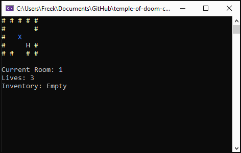

# Temple of Doom (C# Console)

**Code Design–opdracht (Avans, 2025)** — de nadruk ligt op **architectuur en code-kwaliteit**, niet op feature-compleetheid of game-polish. Het speelbare prototype is er om de ontwerpkeuzes te demonstreren.  
**Rol:** Duo/Solo · **Jaar:** 2025

> **Focus van de opdracht:** gestructureerde code, scheiding van verantwoordelijkheden, uitbreidbaarheid en testbaarheid (SOLID, layers, patronen).

## Tech stack
C# · .NET 8 · Console I/O · System.Text.Json

## Design highlights
- **Layered architecture** – `Presentation` (Console) ↔ `BusinessLogic` (domain) ↔ `DataAccess` (loaders). Alleen de UI-laag praat met de Console.
- **Data-gedreven** – levels uit **JSON**; gemakkelijk uit te breiden (bv. XML) via **Strategy** voor loaders.
- **Combineerbare regels** – deur-/itemlogica opgebouwd met **Decorator/Composite** (bijv. *colored* + *closing gate*).
- **SOLID** – kleine klassen met één verantwoordelijkheid; afhankelijkheden via interfaces (DIP) voor testbaarheid.
- **Test seams** – domeinlogica is UI-vrij en daardoor los te testen.

## Demo
Het is een **prototype** om het design te tonen.



### Besturing / doel
- **Bewegen:** pijltjestoetsen / WASD  
- **Doel:** verzamel 5 *Sankara stones* → win; 0 levens → game over

## Snel starten
> Vereisten: **.NET 8 SDK**

```bash
git clone https://github.com/FreekStraten/temple-of-doom-csharp-2025.git
cd temple-of-doom-csharp-2025
dotnet build
dotnet run --project TempleOfDoom.Presentation
```

## Projectstructuur
```
TempleOfDoom.sln
TempleOfDoom.BusinessLogic/   # Domein & game‑logica (beweging, items, deuren)
TempleOfDoom.DataAccess/      # Level loaders (JSON; extensible naar XML/…)
TempleOfDoom.Presentation/    # Console UI (enige laag die Console aanspreekt)
```

## Levelbestand (JSON – voorbeeld)
```json
{
  "rooms": [
    { "id": 1, "width": 5, "height": 5,
      "items": [ { "type": "sankara stone", "x": 2, "y": 2 } ]
    }
  ],
  "connections": [
    { "from": 1, "dir": "EAST", "to": 2,
      "door": [ { "type": "colored", "color": "red" } ]
    }
  ],
  "player": { "startRoomId": 1, "startX": 2, "startY": 2, "lives": 3 }
}
```

## Ontwerpkeuzes
- **Layered**: Presentation (Console) · BusinessLogic (domain) · DataAccess (loaders). Alleen de UI‑laag schrijft naar Console.
- **Strategy** voor data‑loaders (JSON nu, later uitbreidbaar met XML).
- **Decorator/Composite** om deur‑eigenschappen te combineren (bijv. *colored* + *closing gate*).

## Refactor‑backlog
- Services **ontkoppelen** (vermijd deep nesting en lange `switch`‑ketens).
- **Inappropriate intimacy** verminderen: logica naar domeinobjecten verplaatsen.
- **IceTile** implementeren (nu placeholder).
- Unit tests toevoegen voor movement, door‑rules en item‑interactie.

## Credits
Gemaakt in **duo/solo** voor het vak **Code Design** (Avans Hogeschool), 2025.
